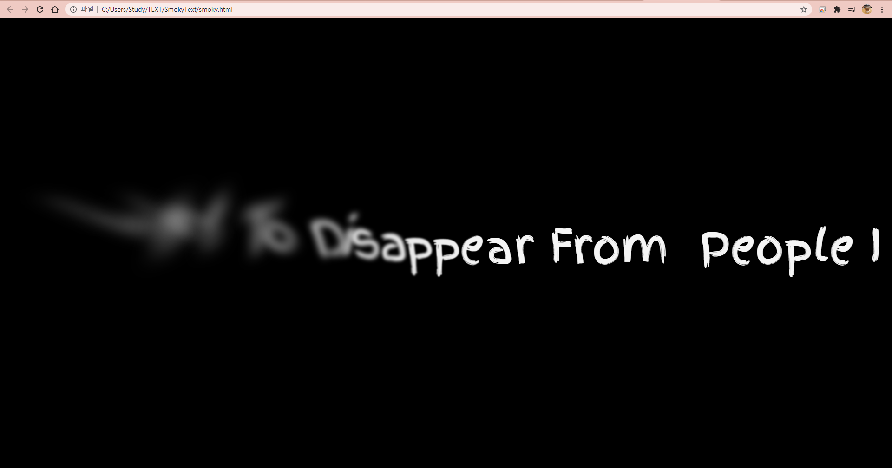

# 2021.01.20(수)

## 인공지능
- 인공지능1 부장선배의 강의를 들었다.
- 수업 계획(논문 위주)과 기본적인 이론, 수학 공식 등을 들었다.

## 취미
- 심심해서 예시를 보고 css를 사용한 효과를 만들었음
- 예시에서 scss를 사용해 scss를 사용하려 했으나 안함
- 38분 43초

## 프로젝트
- 아이디어 총 정리 및 아이디어 1차 투표
- 약 1시간

## 토익
- Week1 1~3일차 복습

## 오늘 하루
- 이러면 안되지만 토익을 하루 쉬었다.
- 스페인어도 하루 쉬었다.
- 공부도 운동도 다른 활동도 거의 없이 쉬었다.
- 정말 보람차지 않은 하루다.